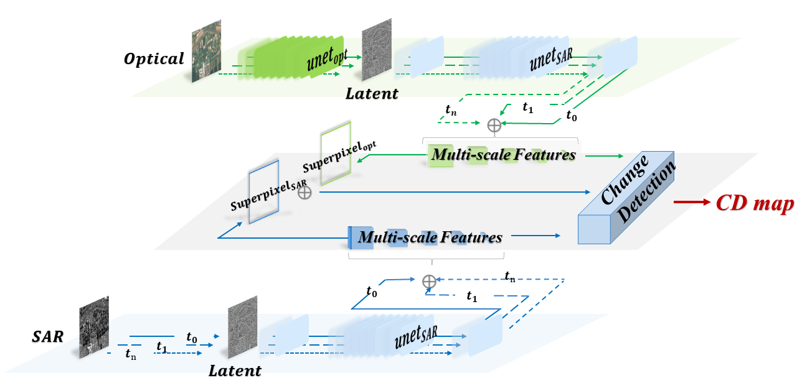

# Diffpurifier
!




The pytorch implementation for "[Diffpurifier: An Optical and SAR Image Change Detection Method Based on Diffusion Purification](https://ieeexplore.ieee.org/document/11029277) ". The paper is published on IEEE Transactions on Geoscience and Remote Sensing. 

## Requirements

- Python 3.9

- Pytorch 2.1

- torchvision 0.16.0

```
# other packages needed
pip install -r requirements.txt
```

## Dataset

- [California](https://sites.google.com/view/luppino/data) paper: [Unsupervised Image Regression for Heterogeneous Change Detection](https://ieeexplore.ieee.org/document/8798991)
- [Gloucester1](https://www.iro.umontreal.ca/~mignotte/) paper: [Multimodal change detection in remote sensing images using an unsupervised pixel pairwise-based Markov random field model](https://ieeexplore.ieee.org/document/8796406)
- [Gloucester2](https://www.grss-ieee.org/technical-committees/image-analysis-and-data-fusion/) paper: [Multi-modal change detection, application to the detection of flooded areas: Outcome of the 2009–2010 data fusion contest](https://ieeexplore.ieee.org/document/6144016)
- [shuguang](https://www.iro.umontreal.ca/~mignotte/) paper: [Multimodal change detection in remote sensing images using an unsupervised pixel pairwise-based Markov random field model](https://ieeexplore.ieee.org/document/8796406)

  The data folder contains cropped and partitioned images from each dataset.

## Train

    CUDA_VISIBLE_DEVICES=1,3 OMP_NUM_THREADS=2 torchrun  --standalone --nnodes=1 --nproc_per_node=2 /data/yiquan.xu/Diffpurifier/scripts/ddpm_cd.py

## Test

    CUDA_VISIBLE_DEVICES=1,3 python /data/yiquan.xu/Diffpurifier/scripts/ddpm_cd_test.py
    
## Visualization

    CUDA_VISIBLE_DEVICES=1,3 python /data/yiquan.xu/Diffpurifier/scripts/ddpm_cd_vision.py

## Pre-trained models

The pre-trained models in each dataset are available. 

## Citation

If you find this work valuable or use our code in your own research, please consider citing us with the following bibtex:

```
@ARTICLE{11029277,
  author={Xu, Yiquan and Su, Xin and Zhang, Liangpei},
  journal={IEEE Transactions on Geoscience and Remote Sensing}, 
  title={Diffpurifier: An Optical and SAR Image Change Detection Method Based on Diffusion Purification}, 
  year={2025},
  volume={63},
  number={},
  pages={1-22},
  keywords={Translation;Feature extraction;Training;Optical sensors;Optical imaging;Disasters;Adaptive optics;Diffusion models;Remote sensing;Radar polarimetry;Change detection (CD);denoising diffusion probabilistic models (DDPMs);image translation (IT);optical;ordinary differential equations (ODEs);synthetic aperture radar (SAR)},
  doi={10.1109/TGRS.2025.3578386}}

```

## Contact Information

schweppesxu@gmail.com

## References

Appreciate the work from the following repositories:

- [llu025/Heterogeneous_CD](https://github.com/llu025/Heterogeneous_CD)
- [likyoo/Siam-NestedUNet](https://github.com/likyoo/Siam-NestedUNet)
- [Bobholamovic/ESCNet](https://github.com/Bobholamovic/ESCNet)
- [lixinghua5540/MTCDN](https://github.com/lixinghua5540/MTCDN)

